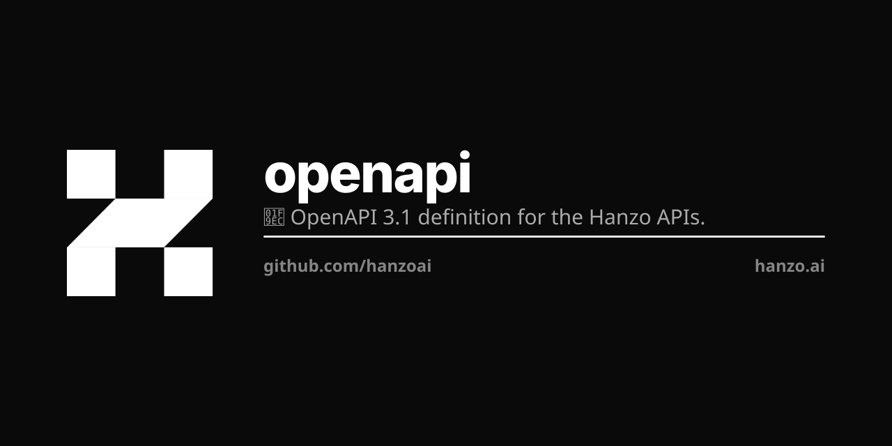

<p align="center"></p>

# Hanzo OpenAPI

**`hanzo.yaml` is THE published document, and it is OUTPUT.** One OpenAPI 3.1
surface for every Hanzo service — the one every SDK, doc site and tool generates
from — DERIVED by `publish.py` from hanzoai/cloud's own emitted `openapi.yaml` at
one pinned release. To change the API, change the code in hanzoai/cloud. There is
nothing here to edit that would make a route exist.

```bash
curl -fsSL -H "Authorization: Bearer $GITHUB_TOKEN" \
  https://raw.githubusercontent.com/hanzoai/openapi/main/hanzo.yaml
```

**This repo is private, so that URL needs a token** — unauthenticated it is a
404, not a 403, which reads like a missing file rather than a missing header.
Any fetch of it without an `Authorization` header is broken; `curl -f` under
`set -e` turns that into a build failure with nothing that names the cause.

Nothing generates from anything else, and nothing is pushed to an SDK. The SDK
repos PULL this file and regenerate themselves; a client is never hand-written
and never receives a patch from here.

Until recently this file was a hand-merged union of 52 authored specs with
cloud's document laid on top, and it carried 185 operations cloud does not serve
while missing 425 it does. Both are gone: `publish.py` derives it, and
`publish.py --check` regenerates and diffs, so an operation no code declares is
now structurally impossible. See [LLM.md](LLM.md) for the measurements.

Forward-only. No backwards compatibility, no deprecated paths, no `/api/`
prefix, no cross-brand references. A single bearer JWT from Hanzo IAM
(`https://hanzo.id`) authenticates every route, and every route is
`/v1/<service>/<resource>` — the same path through the gateway
(`api.hanzo.ai`) and through the service's own hostname.

**One exception — AI inference is top-level.** `hanzoai/ai` serves its OpenAI-
and Claude-compatible surface at the bare `/v1/*` paths
(`/v1/chat/completions`, `/v1/completions`, `/v1/embeddings`, `/v1/models`,
`/v1/rerank`, `/v1/messages`) because every OpenAI/Anthropic SDK hard-codes
them: there, the path IS the compatibility contract.

```bash
curl -H "Authorization: Bearer ${HANZO_TOKEN}" \
     https://api.hanzo.ai/v1/chat/completions -d '{"model":"zen5","messages":[...]}'

curl -H "Authorization: Bearer ${HANZO_TOKEN}" \
     https://api.hanzo.ai/v1/billing/balance
```

OIDC discovery: `https://hanzo.id/.well-known/openid-configuration`. The live
document is `https://api.hanzo.ai/v1/openapi.json` — cloud's emission,
unprojected, which is this file's input rather than this file.

## The files

| File | What it is |
|---|---|
| `hanzo.yaml` | **the published document.** GENERATED by `publish.py`; never edited. |
| `.spec-lock` | which hanzoai/cloud release it is a projection of — repo, path, ref, sha256. |
| `CAPABILITIES.md` | GENERATED index, one row per served capability. Never hand-edit. |
| `capabilities.yaml` | the one editorial file: which DOMAIN each capability is shown under. |
| `flows.yaml` | the canonical example set — the same six journeys in every SDK. |
| `publish.py` `generate.py` `skills.py` | publish · clients · agent skills. |

There are no `<service>/openapi.yaml` specs any more, and nothing to author. A
capability appears the release it starts being served and leaves the release it
stops.

## One command

```bash
python3 publish.py            # re-pin to hanzoai/cloud origin/main, derive, write
python3 publish.py --check    # the gate: re-derive at the pinned ref and diff
python3 publish.py --current  # is the pin still cloud's origin/main?
```

It reads a hanzoai/cloud checkout (`../cloud`, or `--cloud DIR`, or `CLOUD_DIR`)
and writes exactly three files: `hanzo.yaml`, `CAPABILITIES.md`, `.spec-lock`.
Nothing is ever written back to hanzoai/cloud.

Cloud's document is the one description of this API that cannot lie about what is
served — cloud weaves it from its own routers and gates the weave by
regenerating from source. `publish.py` adds no operation and no prose; it applies
six rules that make that document GENERATABLE, because openapi-generator refuses
it as it stands (1012 errors, one per route published with an address and no
`responses`) and writes zero files in every language. Each rule is a candidate to
move upstream into cloud's emitter; see [LLM.md](LLM.md).

## Conventions

- The `/v1` path is the immutable contract — there is no `v2`, ever. Breaking
  changes ship as new resources.
- `info.version: 8.0.0` is the generation of this PUBLICATION, and every SDK's
  package version is cut from it. The emitting cloud release is `info.x-spec.ref`;
  the API's own version is `/v1`. Three things, three places.
- operationIds are the document's own (`get_v1_billing_balance`) — no `<svc>_`
  prefix, because a prefix invented here is a second naming authority and the
  bare id is what the MCP door already uses as a tool name.
- No `deprecated: true`. No `/api/` prefix. No dates in filenames.
- Security: every operation uses `bearerAuth`. No service has its own login.
- Errors: 4xx client, 5xx server, JSON body with `status` and `msg`.
- Nothing here can declare a route cloud does not serve. `skills.py` has no
  liveness filter — an unserved route would ship as a live instruction to an
  agent to call a dead endpoint — so the guarantee has to be structural rather
  than a habit. See LLM.md, "Who reads this repo".

## Validate

```bash
python3 publish.py --check                       # the artifact is its input's projection
python3 test_publish.py                          # the six rules, offline
python3 test_flows.py                            # every example's operationId resolves

java -jar ~/.cache/openapi-generator/openapi-generator-cli-7.14.0.jar validate -i hanzo.yaml
npx -y @redocly/cli preview-docs hanzo.yaml
```

## Clients

`generate.py` runs openapi-generator (pinned **7.14.0**) over `hanzo.yaml` for
every language; `sdks.yaml` is the per-language data, and each SDK repo carries
only a call site. There is no second generator and no unified SDK monorepo.

```bash
python3 generate.py --all            # regenerate every client in place
python3 generate.py go               # just one
python3 generate.py --all --check    # fail if a committed client drifted
```

| Lang | Canonical repo | Generator | Ships as |
|---|---|---|---|
| Python | `hanzoai/python-sdk` | `python` | `hanzoai` on PyPI |
| TypeScript | `hanzoai/js-sdk` | `typescript-axios` | `hanzoai` on npm |
| Java · Kotlin | `hanzoai/java-sdk` · `hanzoai/kotlin-sdk` | `java` · `kotlin` (okhttp) | `ai.hanzo:hanzo-{java,kotlin}-cloud` |
| Rust | `hanzo-rs/sdk` | `rust` (reqwest) | `crates/hanzo-client` — own `scripts/generate.sh` (needs a template override) |
| Go | `hanzo-go/sdk` | `go` | `package hanzoai` at the module root — own `scripts/generate.sh` (no directory to own) |

A language stays in `sdks.yaml` while its whole invocation is expressible as
data, and leaves when it needs something that is not — a template file, or a
layout `take` cannot describe. It then owns the whole invocation in its own
repo. A row here AND flags there is two declarations of one contract.

Examples are not a per-SDK decision either: `flows.yaml` names the six journeys
(`hello`, `chat`, `money`, `store`, `agent`, `tools`) and every SDK renders the
same six from the same operationIds. `python3 test_flows.py` is the gate — an id
that no longer resolves fails here, once, instead of in six clients separately.

## Agent skills

`skills.py` derives `/.well-known/agent-skills/` from `hanzo.yaml`, cut by each
operation's own capability tag, clustering `GET` endpoints by resource — read-only by construction, no
destructive verb ever becomes a skill — and emits a `SKILL.md` per cluster plus
an `index.json` carrying a sha256 of every file.

```bash
python3 skills.py                 # dist/agent-skills/<brand>/…  (hanzo, lux, zoo)
python3 skills.py --no-services   # unified tree only (what the cloud binary embeds)
python3 skills.py --check         # drift gate
python3 test_skills.py            # golden test
```

Output is white-labeled per brand: a Lux surface reads `Lux` / `api.lux.network`
/ `lux.id`, a Zoo surface `Zoo` / `api.zoo.ngo` / `zoo.id` — never Hanzo.
`dist/` is generated at build time and is not committed.

## License

MIT OR Apache-2.0, at your option — per [HIP-0137](https://github.com/hanzoai/hips/blob/main/HIPs/hip-0137-one-license.md). Copyright Hanzo AI, Inc.
